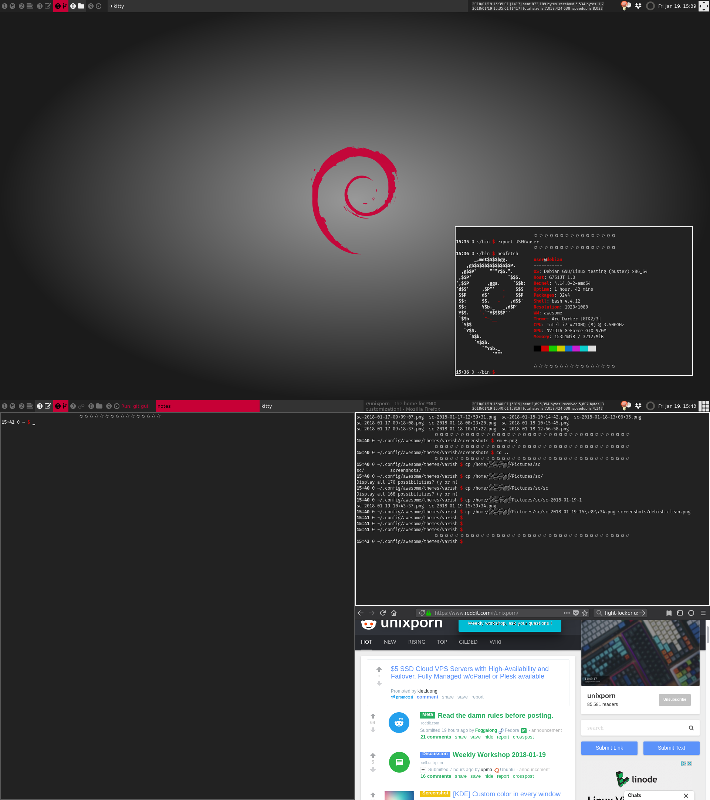
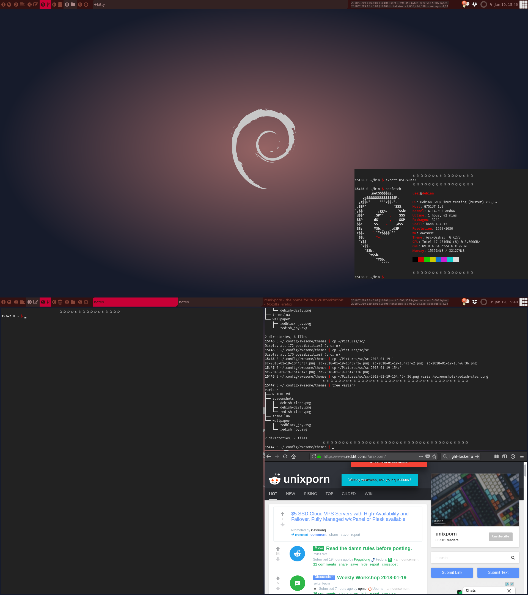

# Varish #

## About ##

This is a simple awesome wm theme derived from the
[default](https://github.com/awesomeWM/awesome/blob/v4.0/themes/default/theme.lua)
theme in awesome 4.0 and I intend to keep it working with the latest version.
The theme has two versions

1. Debish
2. Redish

and it comes with Debish selected. I haven't used reddish and I'll probably
fork debish to it's own theme.

The Redish can be set up with changing the `variant` variable in `theme.lua`.
The theme should be installed at `$XDG_CONFIG_HOME/awesome/themes`, which
usually is `~/.config/awesome/themes` and it can be activated in awesome
configuration with:

```
...
beautiful.init(awful.util.getdir("config") .. 'themes/varish/theme.lua')
...
```

Out of the box the theme uses [FiraCode](https://github.com/tonsky/FiraCode)
and [Fantasque Sans Mono](https://github.com/belluzj/fantasque-sans) fonts, so
these should be installed or the font setting modified.

### Changelog ###

```
2018-04-11
    - added vertical bar (use boolean in theme.lua to change, defaults to vertical)
    - added more layout icons modified from default theme
```

## Debish ##

.

## Redish ##

.

## Tag names on screenshots ##

People seemed interested on the tag names on screenshots, so if you want
something similar they come from the font
[FiraCode](https://github.com/tonsky/FiraCode) and are these
utf codes/characters:

```
➊ 
➋ 
➌ 
➍ 
➎ 
➏ 
➐ ☍
➑ 
➒ 
```

they should show up when using FiraCode as the font for tag names, adding them
is a simple matter of using copy paste to ones personal config files.

## Licensing ##

As a wallpaper this uses recoloured versions of the wallpaper from the beautiful
[Joy](https://wiki.debian.org/DebianArt/Themes/Joy) theme authored by Adrien
Aubourg and used in Debian Wheezy. The wallpapers there are licensed as GPLv2
and thus wallpapers in this theme being derivative works are also licensed
GPLv2. This theme is licensed GPLv2.

Author Niko Humalamäki (nikohuma at gmail.com).

